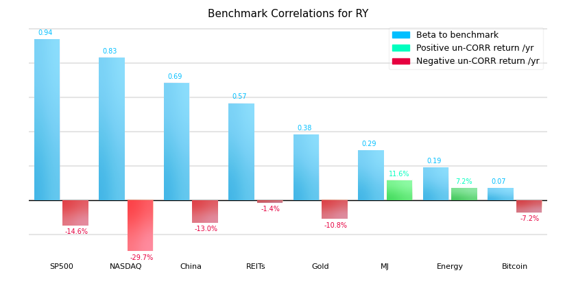

# MySybil's Stock Correlation Analyzer

This set of scripts aim to provide a quick and dirty way to check the correlation and uncorrelated performance of a stock with any index or security that you want to analyze. There are already some websites out there that do this, but the main hope of this is to provide you a small amount of independence from your broker and any websites trying to make money off of you.

The scripts are plug-and-play from a Python3 CLI, but if you decide to use them on an ongoing basis I do ask that you create your own account at developer.tradier.com and generate your own API token in order to alleviate any potential strain on the communal key provided. It's free, it only takes 30 seconds, and you'll never have to worry about fighting with other users around rate-limiting. 

## Getting Started

These instructions will get you a copy of the project up and running on your local machine.

### Dependencies
```
matplotlib
numpy
requests
```

### Example Run

From the CLI run:

```
python3 run_correlations.py
```

You'll be prompted to choose your benchmarks to compare to. Enter: 1

Finally you'll be asked for a symbol to compare to the benchmarks. Enter any symbol of your choice (note: currently no support for indices ie: SPX, VIX).

Nvidia Example:


Royal Bank Example:




### Customization

All the customization for the scripts is handled in the sybil_benchmarks.py (to add your own customized benchmarks or modify the examples) and in correlation_settings.py (if you want to swap in your own API key, change the interval, start date, or risk-free rate).


## Additional Notes

There is an API key hard-coded into the script, it's totally cool for you to use this while deciding if you want to continue to use this script or not, but there is rate-limiting on it and the potential for that to become a problem. If you do plan to use this script frequently or build on-top of it, please head over to developer.tradier.com and sign up for free for an account and get your own API key.


## Authors

* **Teddy Rowan** @  MySybil.com

## Acknowledgments

* I would like to thank Tradier for providing free access to their sandbox API to get free historic options quotes.
